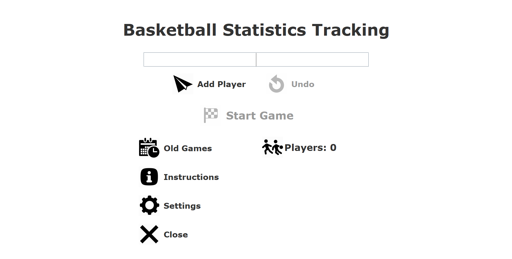
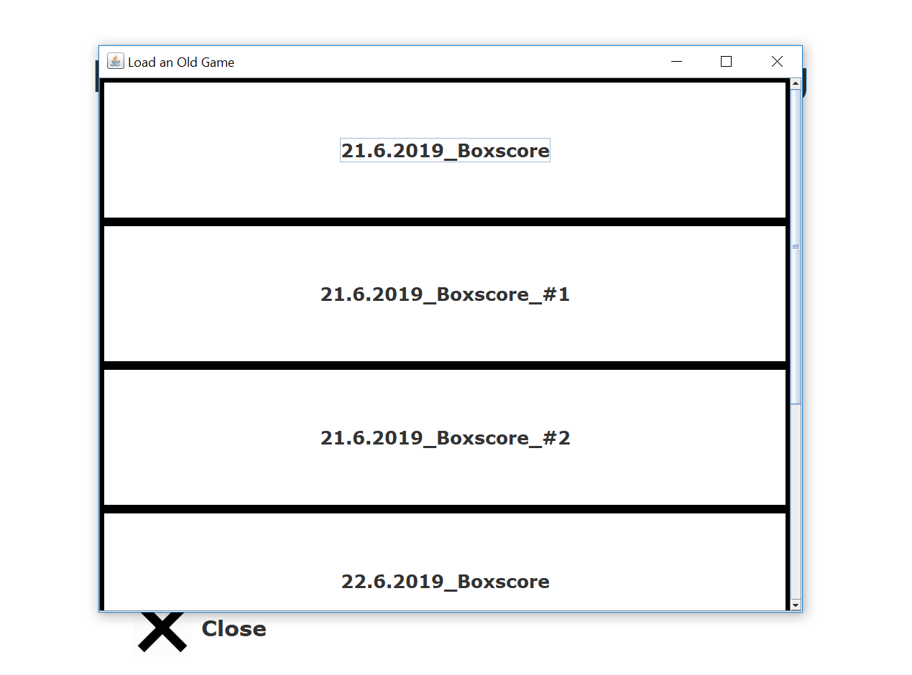
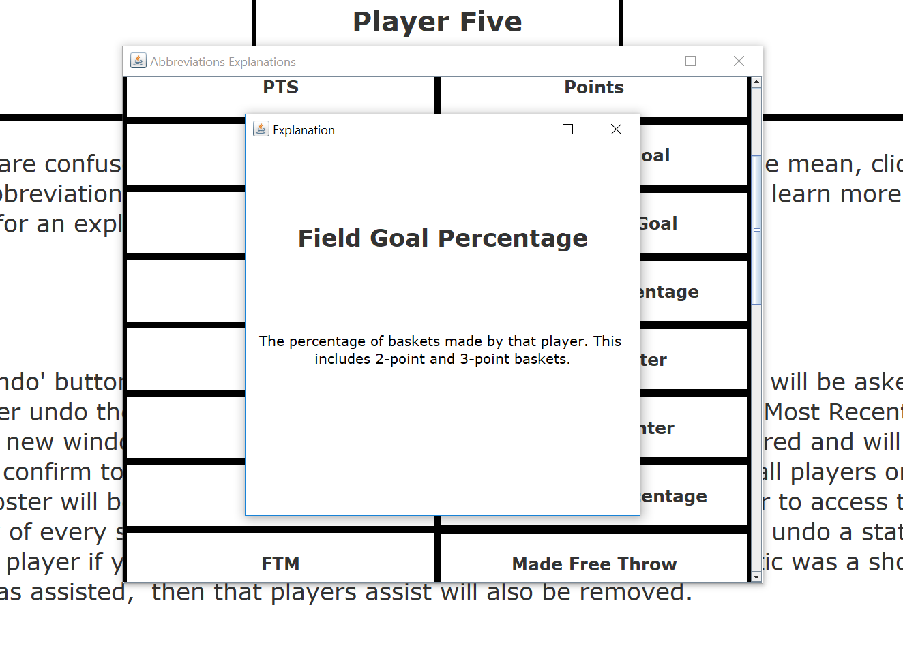
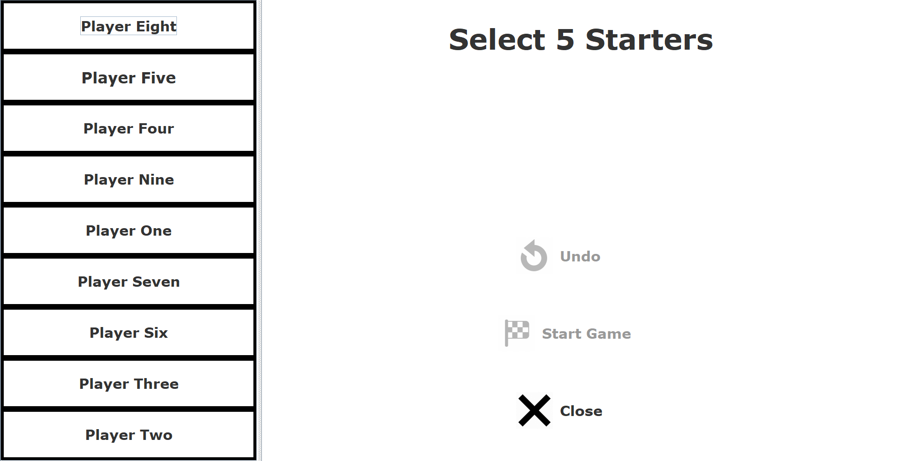

# Basketball-Statistics-Tracking
### By: Alex Eidt
A program that can track player statistics for a Basketball game

[ManagementPanelNoBench]: Screenshots/ManagementPanelNoBench.PNG
[ManagementPanelwBench]: Screenshots/ManagementPanelwBench.PNG
[BoxScoreTable]: Screenshots/BoxScoreTable.PNG
[BoxScoreTableTotal]: Screenshots/BoxScoreTableTotal.PNG
[AddStatWindow]: Screenshots/AddStatPanel.PNG
[BBALLFileType]: Screenshots/BBALLFileType.PNG
[BBALLFileTypeUndo]: Screenshots/BBALLFileTypeUndo.PNG
[UndoButton]: Screenshots/UndoButton.PNG
[OREB]: Screenshots/OffensiveRebounded.PNG
[WhoGotOREB]: Screenshots/WhoGotTheOffensiveRebound.PNG
[Assist]: Screenshots/AssistedFG.PNG
[WhoGotAst]: Screenshots/WhoGotTheAssist.PNG

## Overview:
The Basketball Statistics Tracking Program allows the user to track statistics for all their players
using rules from the Rulebook. 

#### Default Rules and Regulations:
The Player is ejected from the game after:
* 6 Personal Fouls 
* 2 Technical Fouls 
* 2 Flagrant I Fouls
* 1 Flagrant II Foul

The game is set to 4 Quarters each 12 minutes long.

### Home Screen:

When the program is launched from `BasketballMain` the `GetPlayersPanel` is created and is
shown below:

#### Buttons:
##### Entering Players:

Player's first and last names must be entered in the text field. Pressing the
enter key or the Add Players button will add the player to the player list
at the bottom of the `GetPlayersPanel`. To remove the most recently added
player, press the Undo button. The player list is updated every time a player
is added or removed.

##### Load Old Games Button:

The Load Old Games button allows you to load any games you have previously
tracked using this software. In the case of a crash or unwanted closure of 
the program, you can resume tracking your game with no concerns.

Clicking on any one of these games will result in a new window opening
with all your players and their statistics ready to go for you to continue
tracking. The current period and time left in the period will also be shown
based on when the game was closed as well as the number of timeouts and
team fouls that were left. 

##### Instructions Button:

The Instructions button opens a new window with the documentation for the
program. There is text that walks the user through all the components
of the program and has interactive panes where the user can become
familiar with the mechanics of the program. 

Below is a statistic explanation that appears when the Abbreviations button
is clicked. If the user is unfamiliar with Basketball statistic abbreviations
they can look up any abbreviated statistic in the Instructions.

##### Settings Button:

If the user wishes to change the regulations/rules their game is played
by, they can do so in the settings window. 
The background color used throughout the program can also be changed
by clicking one of the colored buttons on the panel on the right.
The settings window is shown below:

##### Close

Clicking the close buttons closes the program.

### Starter Selection:

If the number of players entered in the `GetPlayersPanel` is greater the number
of starters selected in the settings window, then you will need to choose
who will start in your game. The following window opens after the Start Game
button is pressed in the `GetPlayersPanel`: 

Clicking on the player names will add them to a list of players currently
selected to start the game. You will only be able to start the game
once you have selected the appropriate number of starters.

### Statistic Tracking

