# Basketball-Statistics-Tracking
### By: Alex Eidt
A program that can track player statistics for a Basketball Game

# Overview:
***
# Home Screen:

When the program is launched from `BasketballMain` the **Home Screen** is created and is
shown below:

  

## Buttons and Labels:
Icon | Component Name | Description
--- | :---: | ---
 | **Add Player** | Adds the player name entered in the text field. 
 | **Undo** | Removes the most recently added player.
 | **Players** | The players entered by the user. The most recently added player appears at the top of the list.
 | **Start Game** | Becomes enabled when the user enters the minimum required players. The default minimum is 5, however the user can change this in the **Settings**.
 | **Old Games** | Loads any games previously tracked using this software. In the case of a crash or unwanted closure of the program, statistic tracking can resume without any concerns.
 | **Instructions** | Opens a new window with the documentation for the program. There is text that walks the user through all the components of the program and has interactive panes where the user can become familiar with the mechanics of the program. 
 | **Settings** | Allows user to change the rules governing gameplay and the background color of the program while they use it.
 | **Close** | Closes the program.

## Settings Window:
The settings window features several Radio Button groups to change the configurations of the game. There is also the option of changing the background color of the program. The settings window is shown below:

  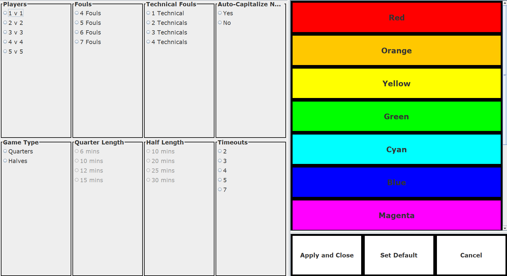

***
# Starter Selection:

If the number of players entered in the **Home Screen** is greater the number
of starters selected in the settings window, then you will need to choose
who will start in your game. 

Clicking on the player names will add them to a list of players currently
selected to start the game. You will only be able to start the game
once you have selected the appropriate number of starters.

  

## Buttons and Labels:
Icon | Component Name | Description
--- | :---: | ---
 | **Undo** | Removes the most recently added starter.
 | **Start Game** | Becomes enabled when the correct number of starters have been entered. Opens a **Roster Management** window.
 | **Close** | Closes the **Starter Selection** window.
***
# Roster Management

If the number of players entered equals the number of starters specified (either by default or in
the settings) then you will be directed to this window after clicking the Start Game
button in the **Home Screen** or if the game you are loading with the **Old Games**
button had as many players as starters specified. 

  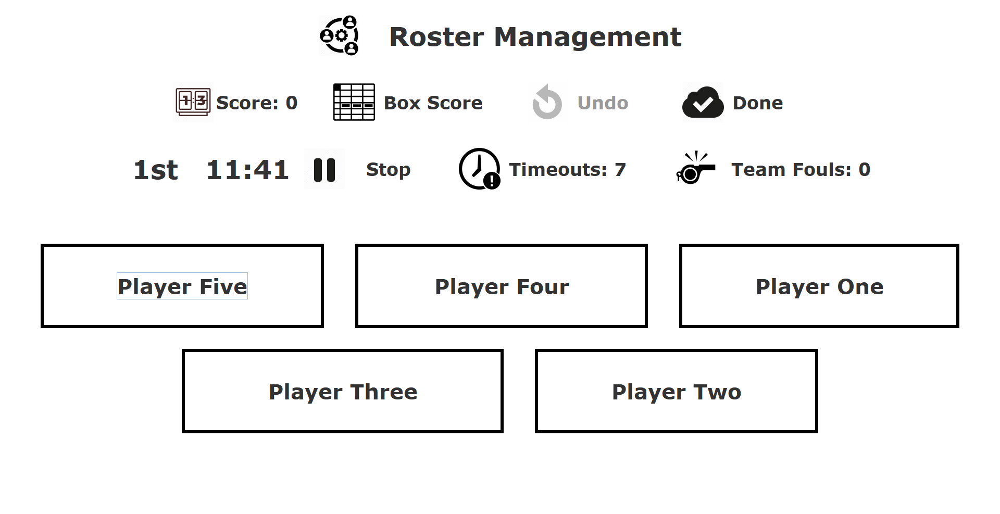

If the number of players entered was greater than the number of starters specified, then you were redirected to the **Starter Selection** window where you chose your starters. Once you pressed the **Start Game** button there, you will be redirected to an alternate version of the **Roster Management** window with starters and a bench. Players who foul out of the game have their button marked red and disabled. If the foul that got that player ejected is removed through the **Undo** Button, then that player's button will become enabled and will be colored light gray to show they are back on the bench and can be substituted in. If only five players remain (or however many starters were specified in the **Settings**) due to player ejections or injuries, then no player that has fouled out will be allowed into the game, contrary to the NBA Rule where the first player who fouled out comes back into the game.

  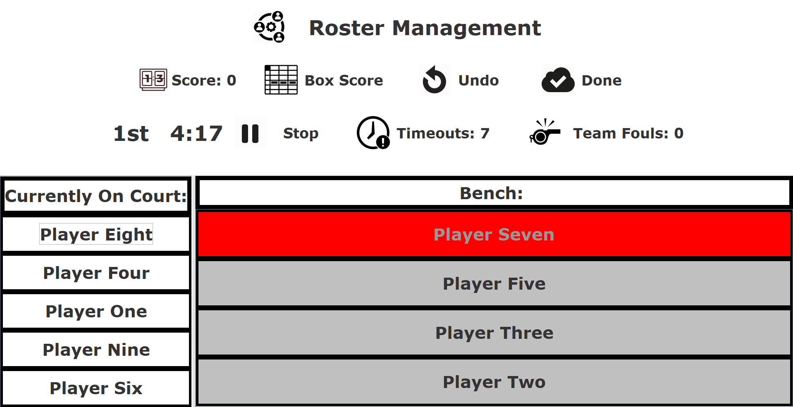

## Buttons and Labels:
Icon | Component Name | Description
--- | :---: | ---
 | **Score** | Shows the total points scored by the team.
 | **Box Score** | Opens a new window showing all player statistics in the traditional Box Score format used for Basketball Games.
 | **Undo** | Opens a new window allowing the user to correct any statistics they entered by deleting them. All periods of the game are shown and clicking on a period shows the user all statistics that were entered during that period. Clicking on any statistic closes the Undo window and removes that statistic.
 | **Done** | Stops the game and closes the **Roster Management** window.
 | **Start/Stop** | Starts/Stops the timer for the game.
 | **Timeouts** | Takes away one timeout (Timeouts remaining shown on button) and stops the  timer.
 | **Team Fouls** | Shows the current number of team fouls in the period. Resets after each period.

## Box Score Button:

The window that appears when the **Box Score** Button is pressed. It shows all player statistics in the traditional 'Box Score' format. The table is shown below:

  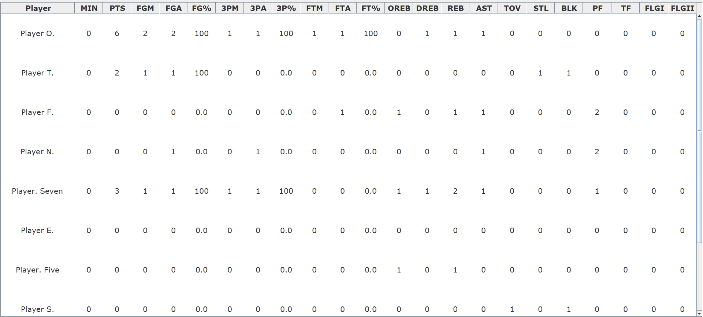

The totals for each statistic are shown in the bottom row:

  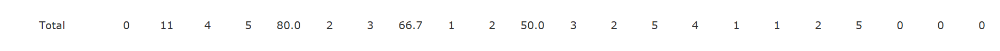

## Player Buttons:

There are some additional features in the **Roster Management** window. When a player's button is clicked (who is on the court), a new window will open that allows the user to select from all possible statistics. Pressing on any statistic will increment that statistic for the given player by the correct amount. This window is shown below:

  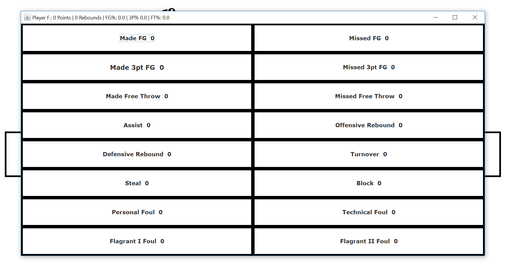

Some statistics increment several other statistics when they are incremented:
1. Made FG
2. Made 3pt FG
3. OREB/DREB

For example, if a Made 3pt FG is selected, then **Points, Made FG, FGA, Made 3pt FG, and 3PA** are all incremented as well.

The program incorporates several features to make statistical tracking quicker during actual game play. The following features highlight this.

If the statistic is a made shot, then the user is asked if the shot was assisted, if that is the case, then the user will be asked who else on the court assisted the shot. These windows are shown below:
  
Was the shot Assisted? | Who got the Assist?
--- | ---
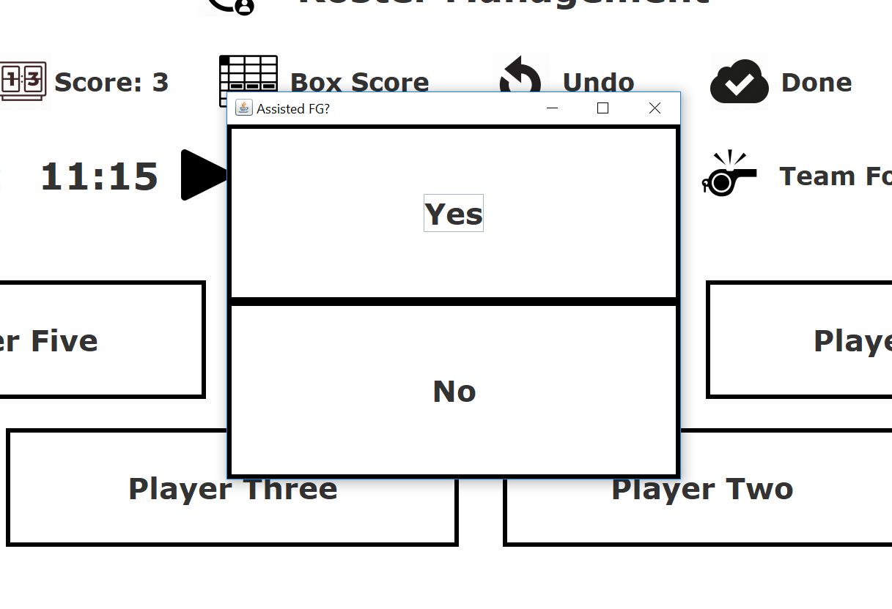 | 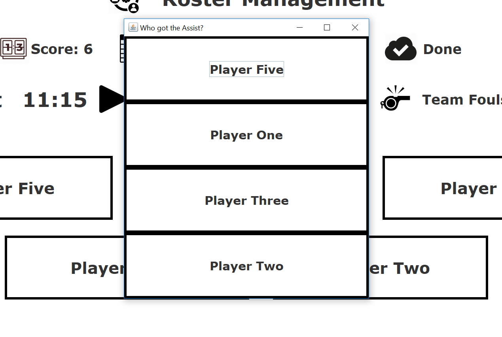

If the statistic is a missed shot, then the user is asked if someone on their team got the Offensive Rebound. As with the shot assist, the user will then be asked who on the team actually got the rebound.

Did a team member get the Offensive Rebound? | Who got the Rebound?
:---: | :---:
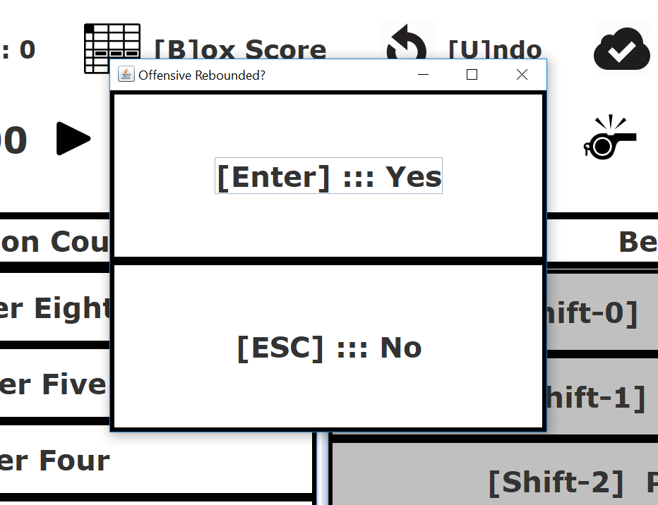 | 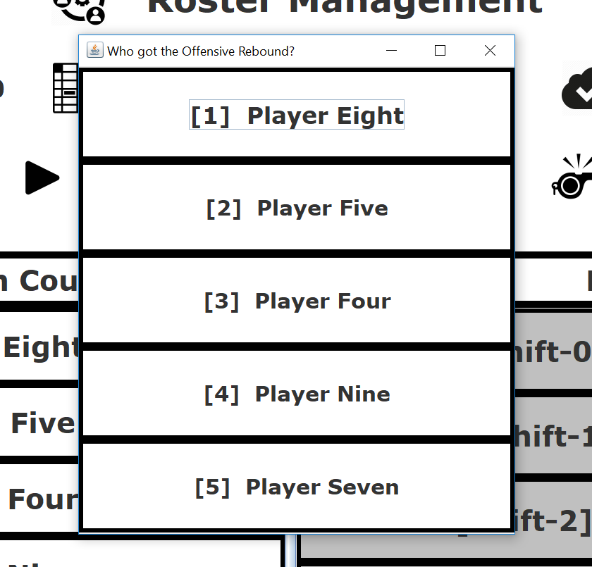

If the **Roster Management** window has a bench panel on it, then clicking on one of the players on the bench will open a window that will ask the user to substitute the player that was clicked into the game. The window is shown below:

  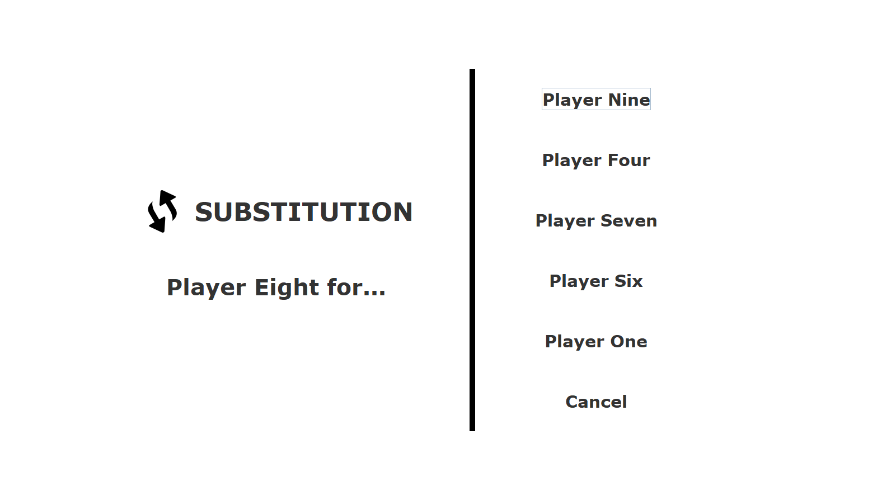

## Undo Button:

If there was a mistake when entering a statistic, it is possible to undo this mistake with the **Undo** Button. When clicked, a window will open with a bar at the top allowing the user to chose from any period of the game. If that period has not yet started, then those buttons will be disabled. When the desired period button is clicked, a list of buttons will appear each showing the statistics entered in chronological order. Clicking on a statistic will close the window and remove that statistic. The window is shown below:

  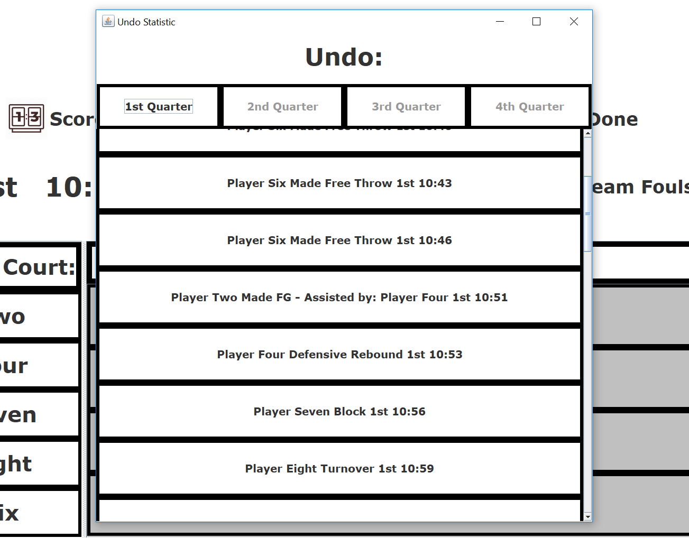

***

**All Images in the 'Image' Folder are not mine and all rights are reserved to their respective owners.**

